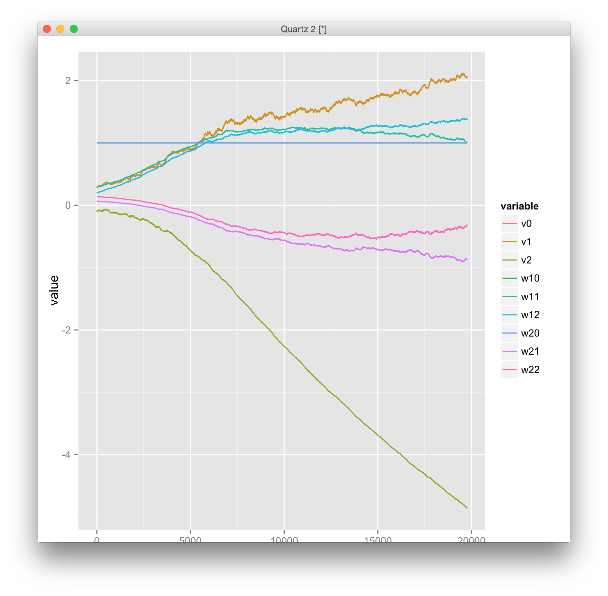

多層パーセプトロン
==============


- 階層型ニューラルネットワークの一種
- （ローゼンブラットの）パーセプトロン（S-A-R層）では解けない問題があった
- Hebbの学習則ではなく、Widrrow-Hoffの学習則（最急降下法）の誤差逆伝播法（Back propagation）を利用
- 後ろ向きに結合荷重を更新していく
- 全ての層における学習を行なう

Widrow-Hoffの学習則（最急勾配法）
----------------


真理値表
------------
### AND

|     |  B=0  |  B=1  |
|:---:|:-----:|:-----:|
| A=0 |   0   |  0    |
| A=1 |   0   |  1    |


### OR
|     |  B=0  |  B=1  |
|:---:|:-----:|:-----:|
| A=0 |   0   |  1    |
| A=1 |   1   |  1    |


### XOR
|     |  B=0  |  B=1  |
|:---:|:-----:|:-----:|
| A=0 |   0   |  1    |
| A=1 |   1   |  0    |


Result
===========

- 分離できたといえなくもないが、性能が悪い
- 初期値依存性（局所解へのはまりこみ）がある

```
$ ruby main.rb

<AND>
initial values:
               v0:1, v1: 0.4052338894203902, v2: -0.03810334546326699
               w10:1, w11: 0.46883315717650287, w12: -0.2552969086929814
               w20:1, w21: 0.008473733481892842, w22: 0.34722903266840843
Ending loop in 21986 times
Computed values:
               v0:1, v1: 2.1005811635883553, v2: -4.904491563858262
               w10:1, w11: 0.8019372522672437, w12: 1.5860610807301811
               w20:1, w21: -1.151034450663704, w22: -0.0764261293716893
Final error: 0.00024955772131275824
train completed
x1 = 0, x2 = 0, t = 0, y = 0.14753236748339704
x1 = 0, x2 = 1, t = 0, y = 0.28964745785617824
x1 = 1, x2 = 0, t = 0, y = 0.36248374406673517
x1 = 1, x2 = 1, t = 1, y = 0.5507679469612801
<OR>
initial values:
               v0:1, v1: 0.034985686516282866, v2: -0.37432320422222454
               w10:1, w11: -0.1618999772120624, w12: -0.3906699150262446
               w20:1, w21: 0.24104408978217695, w22: 0.18963951155437453
Ending loop in 144835 times
Computed values:
               v0:1, v1: -9.164173849586183, v2: 4.824806197134199
               w10:1, w11: -2.0294930850090935, w12: -2.0318207581841574
               w20:1, w21: 4.724311706956751, w22: 4.719177508745165
Final error: 2.499954613346254e-05
train completed
x1 = 0, x2 = 0, t = 0, y = 0.10274999745124397
x1 = 0, x2 = 1, t = 1, y = 0.964046868972129
x1 = 1, x2 = 0, t = 1, y = 0.9640341821495277
x1 = 1, x2 = 1, t = 1, y = 0.9773803727738142
<XOR>
initial values:
               v0:1, v1: 0.4916527082290182, v2: 0.194783915800248
               w10:1, w11: -0.4196289711418557, w12: -0.13067202530308675
               w20:1, w21: 0.2989587518674893, w22: 0.2718435997108758
Ending loop in 326236 times
Computed values:
               v0:1, v1: 2.290613170645746, v2: 2.275235930473833
               w10:1, w11: -10.226301991479632, w12: 5.720522078104194
               w20:1, w21: 5.711606484340538, w22: -10.209095463942992
Final error: 2.4990530214551883e-05
train completed
x1 = 0, x2 = 0, t = 0, y = 0.5567410137137456
x1 = 0, x2 = 1, t = 1, y = 0.7808135577028369
x1 = 1, x2 = 0, t = 1, y = 0.7781630788166889
x1 = 1, x2 = 1, t = 0, y = 0.27260482273815384
```

## 解の収束の様子

